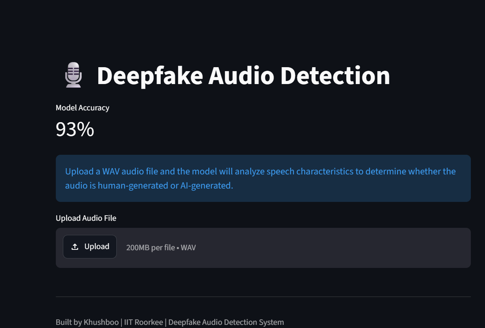
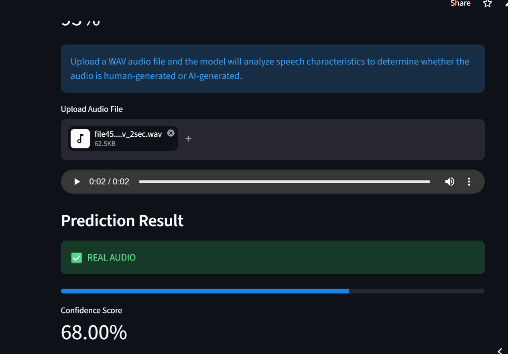
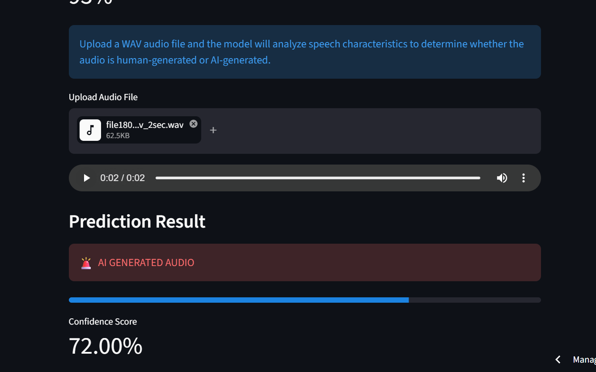

# 🎙️ Deepfake Audio Detection System

<p align="center">
Detect AI-Generated Speech using Machine Learning and Audio Signal Processing
</p>

<p align="center">


</p>

<p align="center">

<a href="https://deepfake-audio-detection01.streamlit.app/">
🚀 Live Demo
</a>

• <a href="https://github.com/Khushubansal29/Deepfake-Audio-Detection-MaRS">
📂 Repository </a>

</p>

---

## 📖 Overview

With the rapid advancement of AI voice synthesis technologies, distinguishing between real and synthetic speech has become increasingly important.

This project uses machine learning and audio signal processing techniques to classify speech recordings as:

* ✅ Real Human Speech
* 🚨 AI-Generated Speech

The system extracts acoustic features from audio recordings and uses a Random Forest classifier to perform detection in real time through an interactive Streamlit web application.

---

## 🎯 Live Demo

👉 https://deepfake-audio-detection01.streamlit.app/

---

## 📸 Application Preview

### Homepage

*Add a screenshot here*

```markdown

```

### Prediction Result

*Add a screenshot here*

```markdown

```

```markdown

```

---

## ✨ Features

* 🎵 Upload WAV audio files
* 🤖 Detect AI-generated speech
* 📊 Confidence score prediction
* 📈 Model evaluation and confusion matrix
* 🌐 Interactive Streamlit web application
* ☁️ Cloud deployment

---

## 🛠️ Tech Stack

| Category         | Technologies   |
| ---------------- | -------------- |
| Programming      | Python         |
| Audio Processing | Librosa, NumPy |
| Data Handling    | Pandas         |
| Machine Learning | Scikit-Learn   |
| Model Storage    | Joblib         |
| Visualization    | Matplotlib     |
| Web Application  | Streamlit      |
| Version Control  | Git, GitHub    |

---

## 🏗️ Project Architecture

```text
Audio File
    ↓
Feature Extraction
(MFCC + ZCR + Spectral Features)
    ↓
Feature Vector Creation
    ↓
Random Forest Classifier
    ↓
Prediction
    ↓
Streamlit Web App
```

---

## 🔊 Audio Features Used

### MFCC (Mel Frequency Cepstral Coefficients)

Captures important speech characteristics and frequency information.

### Zero Crossing Rate (ZCR)

Measures how often the audio waveform changes sign.

### Spectral Centroid

Represents the center of mass of the audio spectrum.

### RMS Energy

Captures average signal energy and loudness.

---

## 📊 Feature Vector

| Feature            | Count  |
| ------------------ | ------ |
| MFCC               | 13     |
| Zero Crossing Rate | 1      |
| Spectral Centroid  | 1      |
| RMS Energy         | 1      |
| **Total Features** | **16** |

---

## 🤖 Model

### Algorithm

```python
RandomForestClassifier()
```

### Why Random Forest?

* Handles non-linear patterns effectively
* Resistant to overfitting
* Works well on structured audio features
* Fast training and inference

---

## 📈 Performance

### Test Results

| Metric    | Score |
| --------- | ----- |
| Accuracy  | 93%   |
| Precision | 93%   |
| Recall    | 93%   |
| F1-Score  | 93%   |

---

## 📉 Confusion Matrix

|             | Predicted Fake | Predicted Real |
| ----------- | -------------- | -------------- |
| Actual Fake | 91             | 5              |
| Actual Real | 10             | 94             |

---

## 📂 Project Structure

```text
Deepfake-Audio-Detection-MaRS
│
├── app
│   └── app.py
│
├── model
│   └── random_forest_model.pkl
│
├── notebooks
│   └── dataset_exploration.ipynb
│
├── src
│   ├── feature_extraction.py
│   ├── predict.py
│   ├── train.py
│   ├── evaluate.py
│   ├── batch_predict.py
│   └── confusion_matrix_plot.py
│
├── requirements.txt
├── README.md
└── .gitignore
```

---

## ⚙️ Installation

Clone the repository:

```bash
git clone https://github.com/Khushubansal29/Deepfake-Audio-Detection-MaRS.git

cd Deepfake-Audio-Detection-MaRS
```

Install dependencies:

```bash
pip install -r requirements.txt
```

---

## ▶️ Run Locally

```bash
streamlit run app/app.py
```

Open:

```text
http://localhost:8501
```

---

## 🚀 Future Improvements

* Deep Learning based detection
* CNN Spectrogram Classification
* Wav2Vec2 Integration
* Transformer Models
* Multi-Class Audio Classification
* MP3 / FLAC Support
* Batch Uploads

---

## 📚 Learning Outcomes

Through this project I gained hands-on experience in:

* Audio Signal Processing
* Feature Engineering
* Machine Learning Pipelines
* Model Evaluation
* Streamlit Development
* Cloud Deployment
* Git & GitHub Workflows

---

## 👩‍💻 Author

**Khushboo Bansal**

B.Tech Chemical Engineering
Indian Institute of Technology Roorkee

GitHub: https://github.com/Khushubansal29

---

<p align="center">
⭐ If you found this project interesting, consider starring the repository!
</p>
